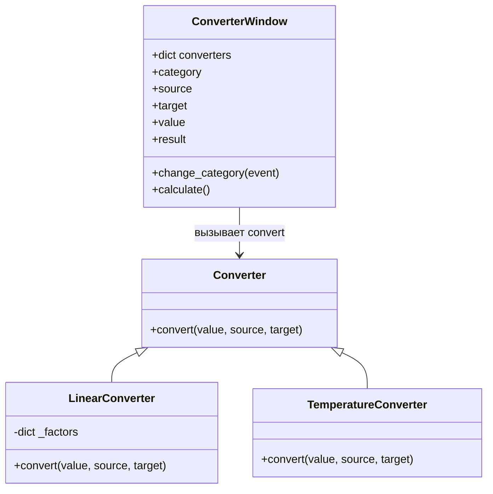

# Диаграмма классов

```mermaid
classDiagram
    class Converter {
        +convert(value, source, target)
    }
    class LinearConverter {
        -dict _factors
        +convert(value, source, target)
    }
    class TemperatureConverter {
        +convert(value, source, target)
    }
    class ConverterWindow {
        +dict converters
        +category
        +source
        +target
        +value
        +result
        +change_category(event)
        +calculate()
    }
    Converter <|-- LinearConverter
    Converter <|-- TemperatureConverter
    ConverterWindow --> Converter : вызывает convert
```

